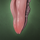
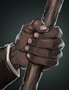
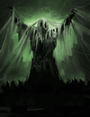

# Philosofruits: card titles

Fill-in list for `PHF_CARDS` in `FallenLondon/choice-helper.js`. The wiki records no text
for this Fate-locked content, so every title has to be read off the game.

- **Card title**: visible in the hand (the badge tooltip quotes it under "The game shows").
- **Option titles**: only visible on the *opened* card (`.branch__title`). Open the card,
  copy each option title, tick it here.
- Match an option to its row by the picture.
- Matching by picture is confirmed in game (cards and options), so untitled rows still badge.
- Pictures are the game's own icons (`images.fallenlondon.com/icons/`), kept in `img/`.
- Last updated 2026-10-07.

## Cards

### [x] The Roots of Wisdom — `treeblue`, 100% 

- [ ]  `treesmall` — +A, Shapeling Arts 2
- [ ]  `cagedmansmall` — +R, Dangerous

### [x] Mycorrhizal meditations — `blemmigan`, 100% 

- [ ]  `mushroomsmall` — +C, Kataleptic Toxicology 2
- [ ]  `blacksmall` — +R, Persuasive

### [x] A Philosophy Close to Home — `passerby`, 100% 

- [ ]  `salon3small` — +F, Mithridacy 2
- [ ]  `ring_brokensmall` — +R, Watchful

### [x] A Meeting of Minds — `argument`, 80% 

- [ ]  `tonguesmall` — +C, Dangerous
- [ ]  `confidentsmilesmall` — +A, Persuasive
- [ ]  `ropecourtsmall` — +F, Shadowy
- [ ]  `blacksmall` — +R, Mithridacy

### [x] Philosophers without Portfolio — `crowd2`, 50% 

- [ ]  `uttershroom_portsmall` — +C, Watchful 150
- [ ]  `spidertreesmall` — +A, Dangerous 150
- [ ]  `servantsmall` — +F, Persuasive 150
- [ ]  `salon3small` — +Y, clears hand, Shadowy

### [x] The Deeper Wisp-Ways — `jungle`, 80% 

- [ ]  `blueeyesmall` — +Y, Watchful 150

### [ ] title needed — `stick`, 50% 

- [ ]  `fistsmall` — +Y, Dangerous 150

### [x] The Matter of Solacefruit — `cherries`, 100% 

- [ ]  `whispered_secretsmall` — +Y, Persuasive 150

### [x] Endless Bounty — `mangrovecollege_interior`, 80% 

- [ ]  `cherriessmall` — Nightmares −4, Wounds +2, Kataleptic Toxicology
- [ ]  `applegallssmall` — +Y, Nightmares +2
- [ ]  `creepyhandsmall` — Solacefruit ×10, Watchful 150

### [ ] title needed — `elegaiccockatoo`, 80%, only while Yield 3+ 

- [ ]  `heartfruitsmall` — Wounds −2, Shadowy

### [ ] title needed — `drowned`, 200%, only while Curiosity 3+ 

- [ ]  `toolboxsmall` — −3C, +3Y

### [ ] title needed — `spidertree`, 200%, only while Asceticism 3+ 

- [ ]  `mercyhandsmall` — −3A, +3Y

### [ ] title needed — `parrot`, 200%, only while Frivolity 3+ 

- [ ]  `booktearssmall` — −3F, +3Y

## Totals

- Cards titled: 8 of 13
- Options titled: 0 of 24
